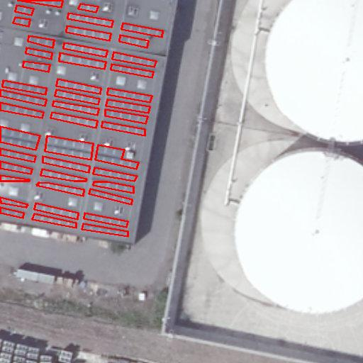

# Portage WMTS → WMS — validation de l'alignement

Tuile `609314_533162` : polygones annotés manuellement en 2020
(`resources/walonmap/via_liege_city.json`, format VIA) superposés en rouge
sur l'image récupérée aujourd'hui via WMS (`python/wms.py`), après le retrait
du service WMTS par le géoportail wallon. Les contours épousent exactement
les rangées de panneaux photovoltaïques du toit, ce qui confirme que le
nouveau quadrillage (constantes figées du `TileMatrix` `"15"`) reproduit
fidèlement l'ancien : les 661 tuiles annotées restent utilisables telles
quelles pour le fine tuning.

Générée par [`python/tests/check_alignment.py`](../../../python/tests/check_alignment.py).
